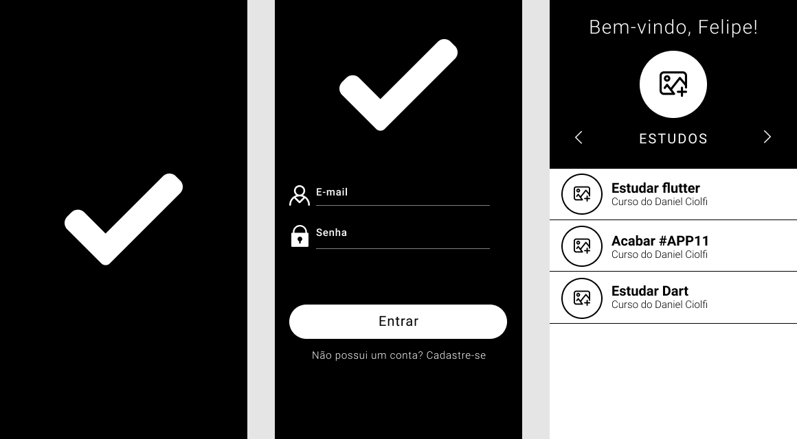
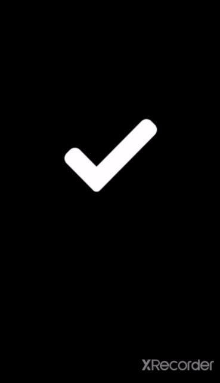

# Animated Login Screen with Flutter

---

Login screen animated developed in flutter. Inspired by application #11 of Daniel Ciolfi's course.

 

## Features

- **Flutter** -  A framework developed by Google in the Dart language.

## Getting Started

1. Clone this repo using `git clone https://github.com/felipebufelli/to_do_list.git`
2. Move yourself to the appropriate directory: `cd to_do_list`
3. Run `flutter run` to start the mobile app.

Note: If you choose to start the mobile app in the android emulator, you will have to start the emulator before.